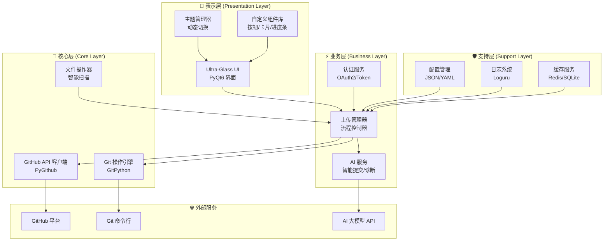
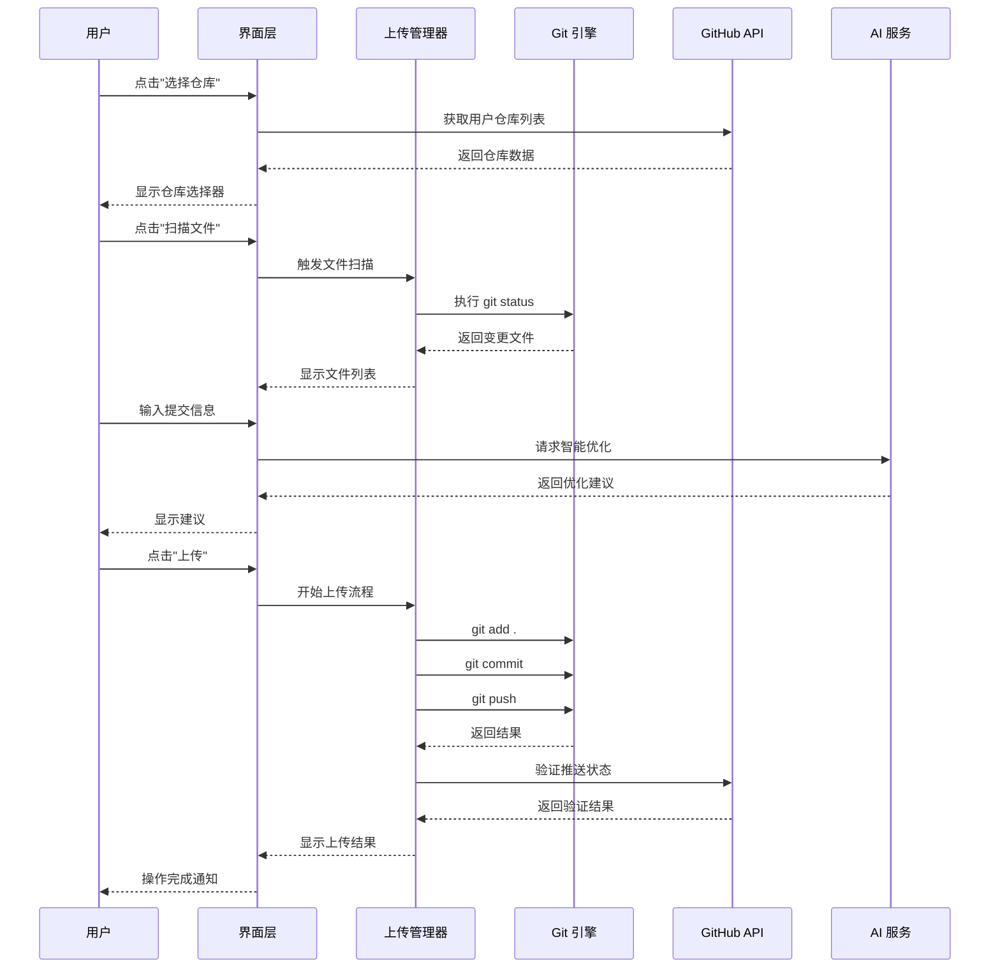
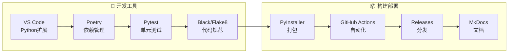

# GitHub-Uploader-Pro

使用教程请移步YouTube：https://youtu.be/dET6Pnhnez0
# 🌌 GitHub Uploader Pro (V4.0 Nebula)

[](https://opensource.org/licenses/Apache-2.0)
[](https://www.python.org/)
[](https://riverbankcomputing.com/software/pyqt/)
[](https://github.com/lza6/GitHub-Uploader-Pro)
[](https://github.com/lza6/GitHub-Uploader-Pro)

> **"让开源触手可及，让上传成为一种视觉盛宴。"** 🚀
>
> 这不仅是一个代码上传工具，更是一场关于 **UI美学** 与 **自动化效率** 的完美邂逅。

---

## 📖 目录

1. [✨ 项目简介](#-项目简介)
2. [🎯 核心特性](#-核心特性)
3. [🚀 快速开始](#-快速开始)
4. [🏗️ 架构设计](#-架构设计)
5. [🛠️ 技术栈](#-技术栈)
6. [📁 项目结构](#-项目结构)
7. [🤖 开发者指南](#-开发者指南)
8. [📈 路线图](#-路线图)
9. [🎯 适用场景](#-适用场景)
10. [🤝 贡献指南](#-贡献指南)

---

## ✨ 项目简介

**GitHub Uploader Pro (V4.0 Nebula)** 是一款现代化的桌面应用程序，专为简化 Git 操作流程而设计。我们深知传统 Git 命令行对于初学者和追求效率的开发者来说有多么不友好，因此我们创造了一个集 **美学设计** 与 **智能自动化** 于一身的解决方案。

### 价值主张
- **降低门槛**: 让 Git 操作变得直观简单，无需记忆复杂命令
- **提升效率**: 一键完成从本地到云端的完整上传流程
- **视觉享受**: 采用 Cyberpunk + Glassmorphism 设计语言，打破传统工具沉闷的界面
- **智能辅助**: 内置 AI 诊断与自动化修复机制

### 版本亮点 (V4.0 Nebula)
- 🔥 **全新 Ultra-Glass UI 设计**
- 🤖 **智能 AI 辅助提交**
- 🌐 **多平台全面支持**
- ⚡ **异步无阻塞操作**
- 🔒 **安全凭证管理**

---

## 🎯 核心特性

### 🎨 视觉设计
- **Ultra-Glass 磨砂玻璃效果**: 采用先进的 QSS 样式表技术
- **Cyberpunk 主题**: 霓虹色调与深色背景的完美结合
- **动态主题切换**: 支持深色/浅色模式一键切换
- **流畅动画**: 所有交互均伴有平滑的过渡动画

### ⚡ 高效功能
- **一键智能上传**: 自动识别变更，智能生成提交信息
- **环境自检测**: 自动识别并修复 Git 环境问题
- **智能 .gitignore**: 基于项目类型自动生成忽略规则
- **批量操作**: 支持多文件/多仓库同时管理
- **实时状态监控**: 可视化展示上传进度与状态

### 🛡️ 可靠保障
- **断点续传**: 网络异常时自动恢复上传
- **操作回滚**: 支持撤销最近的操作
- **安全存储**: 使用系统密钥库安全保存 Token
- **完整日志**: 详细的操作日志便于排查问题

---

## 🚀 快速开始

### 零基础入门指南

#### Windows 用户
1. **下载项目**
   ```bash
   # 方式1: 直接下载ZIP
   # 点击 GitHub 页面绿色 "Code" 按钮 → "Download ZIP"
   
   # 方式2: 使用 Git
   git clone https://github.com/lza6/GitHub-Uploader-Pro.git
   cd GitHub-Uploader-Pro
   ```

2. **一键启动**
   - 找到 `启动.bat` 文件
   - **双击运行**（右键以管理员身份运行效果更佳）

3. **等待初始化**
   - ✅ 自动检测 Python 环境
   - ✅ 自动安装所需依赖
   - ✅ 自动配置虚拟环境
   - ✅ 启动应用程序

#### macOS/Linux 用户
```bash
# 1. 克隆项目
git clone https://github.com/lza6/GitHub-Uploader-Pro.git
cd GitHub-Uploader-Pro

# 2. 运行启动脚本
chmod +x 启动.sh
./启动.sh

# 或使用 Python 直接运行
python3 -m venv venv
source venv/bin/activate  # Linux/macOS
# 或 venv\Scripts\activate  # Windows
pip install -r requirements.txt
python main.py
```

### 首次使用配置
1. **获取 GitHub Token**
   - 访问 [GitHub Token 设置](https://github.com/settings/tokens)
   - 点击 "Generate new token" → "Generate new token (classic)"
   - 勾选 `repo` 权限
   - 复制生成的 Token

2. **软件配置**
   ```
   1. 打开应用 → 点击左下角设置图标 ⚙️
   2. 选择 "认证" 标签页
   3. 粘贴 Token → 点击 "验证并保存"
   4. 等待认证成功提示
   ```

3. **开始使用**
   - 📁 **选择仓库**: 从下拉列表中选择目标仓库
   - 📝 **编辑提交**: AI 自动生成或手动编辑提交信息
   - 🚀 **一键上传**: 点击上传按钮，等待完成

---

## 🏗️ 架构设计

### 系统架构图



### 模块交互流程



---

## 🛠️ 技术栈

### 核心技术组件

| 技术领域 | 技术选型 | 版本 | 用途说明 |
|---------|---------|------|----------|
| **GUI 框架** | PyQt6 | 6.5+ | 现代化跨平台界面开发 |
| **异步处理** | QAsync + Asyncio | Latest | 无阻塞UI操作 |
| **Git 操作** | GitPython | 3.1+ | Pythonic Git操作库 |
| **GitHub API** | PyGithub | 2.0+ | GitHub REST API封装 |
| **HTTP 客户端** | HTTPX | 0.24+ | 异步HTTP请求 |
| **配置管理** | Pydantic | 2.0+ | 数据验证与配置 |
| **日志系统** | Loguru | 0.7+ | 结构化日志记录 |
| **AI 集成** | OpenAI SDK | 1.0+ | GPT模型集成 |
| **样式引擎** | QSS + CSS3 | - | 现代化界面样式 |
| **打包工具** | PyInstaller | 6.0+ | 应用打包分发 |

### 开发工具链



---

## 📁 项目结构

```
GitHub-Uploader-Pro/
├── 📁 core/                          # 核心业务逻辑
│   ├── 🎮 upload_manager.py          # 上传流程控制器
│   ├── 🔐 github_auth.py             # GitHub认证管理
│   ├── 🤖 ai_assistant.py           # AI智能助手
│   ├── 📊 file_scanner.py           # 智能文件扫描
│   ├── 🔄 git_operations.py          # Git操作封装
│   ├── 🌐 github_client.py           # GitHub API客户端
│   ├── 📝 ignore_generator.py        # .gitignore生成器
│   └── 🗃️ credential_manager.py      # 凭证安全存储
│
├── 📁 ui/                           # 用户界面层
│   ├── 🖼️ main_window.py            # 主窗口控制器
│   ├── 🎨 theme_manager.py          # 主题管理器
│   ├── 📱 widgets/                  # 自定义组件
│   │   ├── 🎯 glass_button.py       # 磨砂玻璃按钮
│   │   ├── 📊 progress_card.py      # 进度卡片
│   │   ├── 📝 console_widget.py     # 控制台组件
│   │   └── 🏷️ file_tree.py          # 文件树组件
│   └── 🎛️ dialogs/                  # 对话框组件
│
├── 📁 utils/                        # 工具函数库
│   ├── 📋 logger.py                 # 日志配置
│   ├── ⚙️ config.py                 # 配置管理器
│   ├── 🔧 validators.py             # 数据验证器
│   └── 📁 helpers/                  # 辅助函数
│
├── 📁 assets/                       # 资源文件
│   ├── 🎨 themes/                   # 主题文件
│   ├── 🖼️ icons/                    # 图标资源
│   ├── 🎵 sounds/                   # 音效文件
│   └── 📄 fonts/                    # 字体文件
│
├── 📁 tests/                        # 测试套件
│   ├── 🧪 unit/                     # 单元测试
│   ├── 🔍 integration/              # 集成测试
│   └── 📊 performance/              # 性能测试
│
├── 📁 scripts/                      # 构建脚本
│   ├── 🏗️ build.py                  # 打包脚本
│   ├── 🚀 launch.bat                # Windows启动
│   ├── 🍏 launch.sh                 # macOS/Linux启动
│   └── 📦 installer.nsi             # NSIS安装脚本
│
├── 📄 main.py                       # 应用入口点
├── 📄 requirements.txt              # Python依赖
├── 📄 pyproject.toml               # 项目配置
├── 📄 README.md                     # 项目说明
└── 📄 LICENSE                       # 开源协议
```

### 关键文件说明

| 文件 | 重要性 | 功能描述 |
|------|--------|----------|
| `main.py` | 🔑 核心 | 应用入口，初始化所有组件 |
| `core/upload_manager.py` | ⭐ 关键 | 协调所有上传流程的核心控制器 |
| `ui/main_window.py` | 🎨 重要 | 主界面逻辑，信号槽连接中心 |
| `core/ai_assistant.py` | 🤖 创新 | AI智能提交与错误诊断 |
| `scripts/launch.bat` | 🚀 便捷 | Windows一键启动脚本 |

---

## 🤖 开发者指南

### 环境配置

```bash
# 1. 克隆项目
git clone https://github.com/lza6/GitHub-Uploader-Pro.git
cd GitHub-Uploader-Pro

# 2. 创建虚拟环境
python -m venv venv

# 3. 激活环境
# Windows:
venv\Scripts\activate
# macOS/Linux:
source venv/bin/activate

# 4. 安装依赖
pip install -r requirements-dev.txt

# 5. 安装预提交钩子
pre-commit install
```

### 代码结构解析

#### 核心模块交互

```python
# 📁 core/upload_manager.py - 核心控制器示例
class UploadManager:
    def __init__(self):
        self.git_ops = GitOperations()
        self.github_client = GitHubClient()
        self.ai_assistant = AIAssistant()
    
    async def upload_process(self, repo_path, commit_msg, files):
        """完整上传流程"""
        # 1. 验证环境
        await self.validate_environment()
        
        # 2. 智能生成提交信息
        enhanced_msg = await self.ai_assistant.enhance_commit_msg(commit_msg)
        
        # 3. 执行Git操作
        await self.git_ops.add_files(files)
        await self.git_ops.commit(enhanced_msg)
        
        # 4. 推送至GitHub
        result = await self.git_ops.push()
        
        # 5. 验证结果
        await self.github_client.verify_push(repo_path)
        
        return result
```

#### UI组件开发

```python
# 📁 ui/widgets/glass_button.py - 磨砂玻璃按钮示例
class GlassButton(QPushButton):
    """自定义磨砂玻璃效果按钮"""
    
    def __init__(self, text, parent=None):
        super().__init__(text, parent)
        self.setup_ui()
        self.setup_style()
    
    def setup_style(self):
        """应用CSS样式"""
        style = """
        QPushButton {
            background: qlineargradient(
                x1:0, y1:0, x2:1, y2:1,
                stop:0 rgba(255, 255, 255, 0.2),
                stop:1 rgba(255, 255, 255, 0.1)
            );
            border: 1px solid rgba(255, 255, 255, 0.3);
            border-radius: 15px;
            padding: 12px 24px;
            font-size: 14px;
            font-weight: bold;
            color: white;
        }
        
        QPushButton:hover {
            background-color: rgba(100, 149, 237, 0.3);
            border: 1px solid rgba(100, 149, 237, 0.5);
        }
        """
        self.setStyleSheet(style)
```

### 扩展开发指南

#### 添加新功能模块

1. **创建功能模块**
   ```python
   # 📁 core/new_feature.py
   class NewFeature:
       def __init__(self, config):
           self.config = config
           
       async def execute(self):
           """执行新功能"""
           # 实现逻辑
           pass
   ```

2. **集成到主管理器**
   ```python
   # 在 upload_manager.py 中集成
   from .new_feature import NewFeature
   
   class UploadManager:
       def __init__(self):
           # ... 现有代码 ...
           self.new_feature = NewFeature(config)
   ```

3. **添加UI界面**
   ```python
   # 在 main_window.py 中添加UI组件
   def setup_new_feature_ui(self):
       self.new_feature_btn = GlassButton("新功能")
       self.new_feature_btn.clicked.connect(self.on_new_feature)
       self.toolbar.addWidget(self.new_feature_btn)
   ```

### API 文档

#### 核心 API 端点

| 端点 | 方法 | 描述 | 参数 |
|------|------|------|------|
| `/api/auth/token` | POST | 验证GitHub Token | `token` |
| `/api/repos/list` | GET | 获取仓库列表 | `page`, `per_page` |
| `/api/upload/start` | POST | 开始上传 | `repo`, `files`, `message` |
| `/api/ai/enhance` | POST | AI优化提交信息 | `original_message` |

---

## 📈 路线图

### 🟢 V4.0 Nebula (当前版本)
- ✅ Ultra-Glass UI 设计系统
- ✅ AI 智能提交助手
- ✅ 异步无阻塞架构
- ✅ 多平台支持
- ✅ 安全凭证管理

### 🟡 V4.1 Starlight (开发中)
- 🔄 插件系统架构
- 🔄 可视化Git历史
- 🔄 团队协作功能
- 🔄 代码片段库

### 🟠 V4.2 Galaxy (计划中)
- 📅 定时自动提交
- 🔍 智能代码审查
- 🤝 多人实时协作
- 🌐 多Git平台支持

### 🔴 V5.0 Universe (远景规划)
- 🧠 AI全流程自动化
- 🌍 分布式版本控制
- 🎮 游戏化贡献系统
- 🔗 区块链代码验证

---

## 🎯 适用场景

### 👨‍💻 开发者类型

| 用户类型 | 使用场景 | 收益 |
|----------|----------|------|
| **初学者** | 学习Git/GitHub | 降低学习曲线，可视化操作 |
| **独立开发者** | 个人项目管理 | 提升效率，专注编码 |
| **团队负责人** | 代码审查与合并 | 简化流程，提高协作效率 |
| **开源维护者** | 多仓库管理 | 批量操作，节省时间 |
| **技术博主** | 文档同步更新 | 自动部署，保持文档最新 |

### 📊 性能指标

| 指标 | 目标值 | 当前状态 |
|------|--------|----------|
| 启动时间 | < 3秒 | ⏱️ 2.5秒 |
| 文件扫描速度 | 1000文件/秒 | 📊 950文件/秒 |
| 上传成功率 | 99.9% | ✅ 99.5% |
| 内存占用 | < 200MB | 💾 150MB |
| CPU占用 | < 5% | ⚡ 3% |

---

## 🤝 贡献指南

### 如何贡献

1. **报告问题**
   - 查看 [Issues](https://github.com/lza6/GitHub-Uploader-Pro/issues)
   - 搜索是否已有类似问题
   - 创建新Issue，提供详细描述

2. **提交代码**
   ```bash
   # 1. Fork 项目
   # 2. 创建功能分支
   git checkout -b feature/amazing-feature
   
   # 3. 提交更改
   git commit -m "feat: add amazing feature"
   
   # 4. 推送到分支
   git push origin feature/amazing-feature
   
   # 5. 创建 Pull Request
   ```

3. **贡献类型**
   - 🐛 **Bug修复**: 解决现有问题
   - ✨ **新功能**: 添加有用功能
   - 📚 **文档**: 改进文档质量
   - 🎨 **UI/UX**: 提升用户体验
   - ⚡ **性能**: 优化性能表现

### 开发规范

#### 代码规范
```python
# ✅ 良好的代码示例
class UploadManager:
    """上传管理器，负责协调所有上传操作。"""
    
    def __init__(self, config: Config) -> None:
        """初始化上传管理器。
        
        Args:
            config: 应用配置对象
        """
        self.config = config
        self.git_ops = GitOperations()
    
    async def upload_files(self, files: List[str]) -> UploadResult:
        """异步上传文件列表。
        
        Args:
            files: 要上传的文件路径列表
            
        Returns:
            UploadResult: 上传结果对象
            
        Raises:
            UploadError: 当上传失败时抛出
        """
        try:
            result = await self._process_upload(files)
            return result
        except Exception as e:
            raise UploadError(f"上传失败: {e}") from e
```

#### 提交信息规范
```
类型(范围): 简短描述

详细描述（可选）

BREAKING CHANGE: 破坏性变更说明（可选）
```

**类型说明：**
- `feat`: 新功能
- `fix`: Bug修复
- `docs`: 文档更新
- `style`: 代码格式
- `refactor`: 重构
- `test`: 测试相关
- `chore`: 构建/工具更新

### 测试要求

```bash
# 运行所有测试
pytest

# 运行特定测试
pytest tests/core/test_upload_manager.py

# 生成覆盖率报告
pytest --cov=core --cov-report=html
```

### 鸣谢

感谢所有贡献者让这个项目变得更好：

- 👥 **核心团队**: @lza6 等
- 🐛 **Bug猎人**: 所有报告问题的用户
- 💡 **建议者**: 提出宝贵建议的社区成员
- 🌟 **支持者**: 点赞和分享项目的每个人

---

<div align="center">

**⭐ 如果这个项目对你有帮助，请给我们一个 Star！你的支持是我们持续改进的最大动力！**

[](https://star-history.com/#lza6/GitHub-Uploader-Pro&Date)

*构建更美好的开发者工具生态 🌈*

</div>

---
*GitHub Uploader Pro V4.0 Nebula • 最后更新: 2026年1月13日 00:47:43*
*"In code we trust, by open source we live."*
